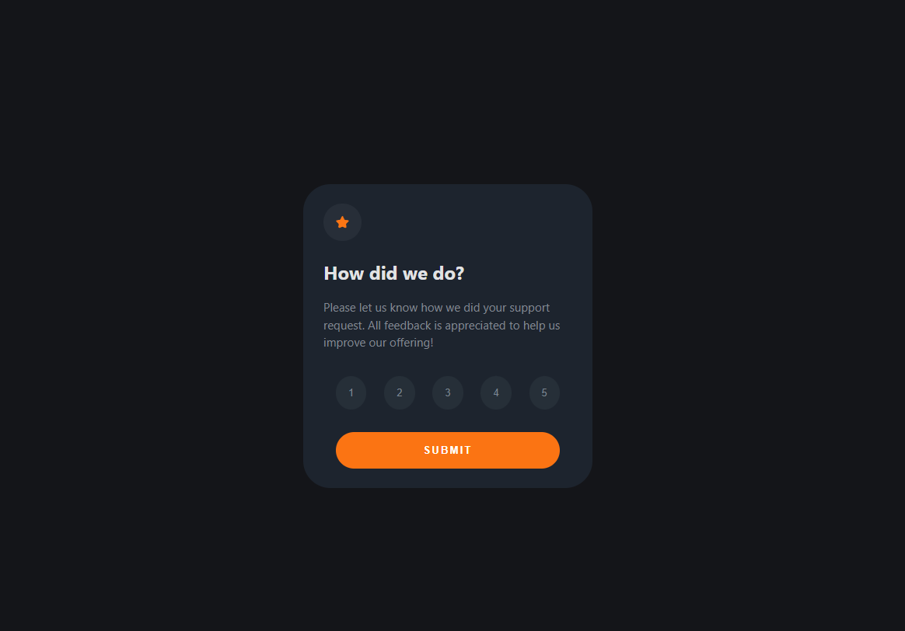

# Frontend Mentor - Interactive rating component solution

This is a solution to the [Interactive rating component challenge on Frontend Mentor](https://www.frontendmentor.io/challenges/interactive-rating-component-koxpeBUmI). Frontend Mentor challenges help you improve your coding skills by building realistic projects.

## Table of contents

- [Overview](https://interactive-rating-component-gamma-puce.vercel.app/)
  - [The challenge](https://www.frontendmentor.io/solutions/challenge-solved-using-reactjs-KHx5_mM7Kb)
  - [Screenshot](/public/preview.png)
  - [Built with ReactJs](https://reactjs.org/)
- [Gabriel Souza](https://www.linkedin.com/in/gabriel-alves-73860a1ab/)

## Overview

  

### The challenge

Users should be able to:

- View the optimal layout for the app depending on their device's screen size
- See hover states for all interactive elements on the page
- Select and submit a number rating
- See the "Thank you" card state after submitting a rating

### Built with

- Semantic HTML5 markup
- CSS custom properties
- Flexbox
- [React](https://reactjs.org/) - JS library
- [Vite](https://vitejs.dev/)
- [CSS Modules]- For styles
